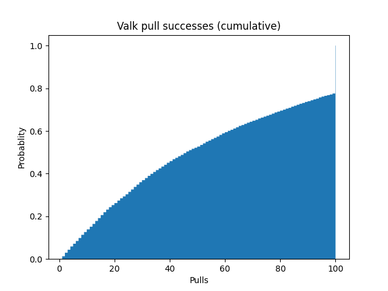
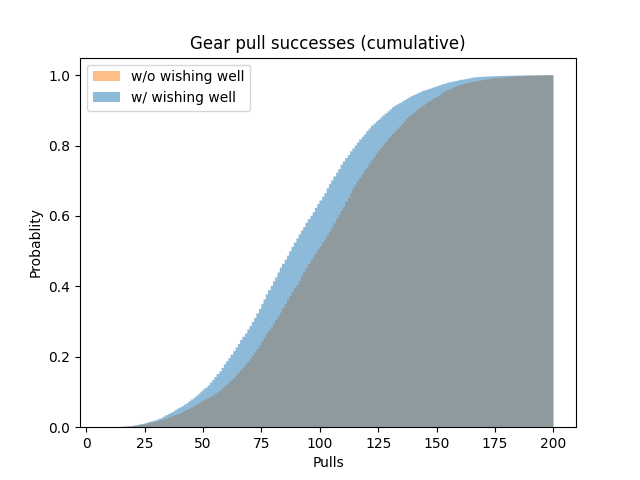
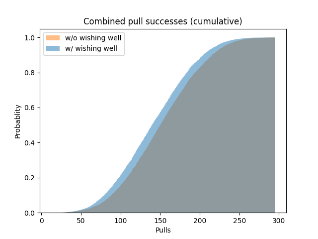

# hi3-gacha-sim
Simple gacha simulator for Hi3

Runs a simulation of Honkai Impact 3 gacha pulls for both expansion supply and focused supply banners.
From the simulations, it's shown that the average player will get the UP valyrie in 50 pulls and all of the gear (including wishing well) in 90 pulls, for a total of 140 pulls or 39,200 crystals.
Not exactly new information, I know, but I wanted to try something.

# The Results

## Valkyrie

### Averages
Mean: 52.04 (14571.42 xtals)  
Median: 46 (12880 xtals)  
Mode: 100 (28000 xtals)

### Chances
18.92 pulls has a 25.0% chance  
45.95 pulls has a 50.0% chance  
92.97 pulls has a 75.0% chance

## Gears

### Averages
With wishing well:  
- Mean: 89 (24921.26 xtals)
- Median: 87 (24360 xtals)
- Mode: 77 (21560 xtals)

Without wishing well:  
- Mean: 99.06 (27736.10 xtals)
- Median: 99 (27720 xtals)
- Mode: 111 (31080 xtals)

### Chances
With wishing well:  
- 66.83 pulls has a 25.0% chance
- 86.90 pulls has a 50.0% chance
- 109.87 pulls has a 75.0% chance
- 129.94 pulls has a 90.0% chance
- 142.87 pulls has a 95.0% chance

Without wishing well:  
- 75.90 pulls has a 25.0% chance
- 98.87 pulls has a 50.0% chance
- 121.84 pulls has a 75.0% chance
- 141.91 pulls has a 90.0% chance
- 152.91 pulls has a 95.0% chance

## Combined

### Averages
With wishing well:  
- Mean: 141.05 (39492.68 xtals)
- Median: 140.0 (39200.0 xtals)
- Mode: 151 (42280 xtals)

Without wishing well:  
- Mean: 151.10 (42307.52 xtals)
- Median: 150.0 (42000 xtals)
- Mode: 140 (39200 xtals)

### Chances
With wishing well: 
- 105.96 pulls has a 25.0% chance
- 139.92 pulls has a 50.0% chance
- 174.73 pulls has a 75.0% chance
- 203.87 pulls has a 90.0% chance
- 220.85 pulls has a 95.0% chance

Without wishing well:  
- 115.86 pulls has a 25.0% chance
- 149.82 pulls has a 50.0% chance
- 184.91 pulls has a 75.0% chance
- 215.76 pulls has a 90.0% chance
- 230.76 pulls has a 95.0% chance